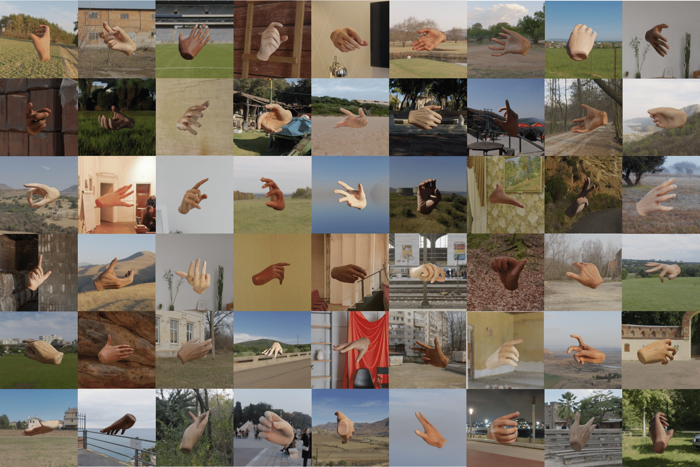

# Analyzing the Synthetic-to-Real Domain Gap in 3D Hand Pose Estimation

The official code of "Analyzing the Synthetic-to-Real Domain Gap in 3D Hand Pose Estimation. CVPR 2025."

[Paper Link](https://openaccess.thecvf.com/content/CVPR2025/papers/Zhao_Analyzing_the_Synthetic-to-Real_Domain_Gap_in_3D_Hand_Pose_Estimation_CVPR_2025_paper.pdf)

<br>

## Installation

### Install bpy
bpy is used to call different blender API.

Here are steps to install bpy:
1. Create conda environment according to blender python module version (usually python 3.10.0, please refer to the cp version shown in bpy whl below)
    ```
    conda create --name yourEnv python=3.10.0
    ```

2. Download `bpy-3.6.0-cp310-cp310-manylinux_2_28_x86_64.whl` from [Links_for_bpy](https://packagemanager.rstudio.com/pypi/latest/simple/bpy/)

3. Install bpy
    ```
    pip install bpy-3.6.0-cp310-cp310-manylinux_2_28_x86_64.whl
    ```
<br>

### Install blender
blender is the engine to run the rendering script.

Here are steps to install blender:
1. Download [blender Linux](https://www.blender.org/download/release/Blender3.6/blender-3.6.21-linux-x64.tar.xz) from https://www.blender.org/download/lts/3-6/ (Recommend to choose the 3.6 version rather than 4.2)

2. export PATH:
    ```
    export PATH=/home/zhuoran/blender-3.6.X-linux-x64:$PATH
    ```
    Replace "X" with the version you downloaded.

<br>

### Set up the python environment

- [Pytorch3D installation](https://github.com/facebookresearch/pytorch3d/blob/main/INSTALL.md).
- [bpycv installation](https://github.com/DIYer22/bpycv?tab=readme-ov-file#-install)

<br>

### Download NIMBLE and MANO models
1. Download the NIMBLE models from [NIMBLE assets](https://drive.google.com/drive/folders/1g7DWuDW5nYI2VDbdemDK2dGVwVHV2a1X?usp=sharing) provided by [NIMBLE](https://github.com/reyuwei/NIMBLE_model).

2. Create an `assets` folder under `./my_NIMBLE_model` and place the downloaded models under `/my_NIMBLE_model/assets/`.

3. Download the MANO_RIGHT.pkl from [MANO](https://mano.is.tue.mpg.de/download.php) in the `Models & Code` section. Place the `MANO_RIGHT.pkl` under `/my_NIMBLE_model/assets/`.

<br>

### Download HDRI scenes

We have uploaded our HDRI scenes for rendering in [Hugging Face](https://huggingface.co/datasets/Alicezrzhao/HandSynthesis/tree/main). Download the images and set the `hdri_bg_path` in `config_syn_data.json`.

<br>

### Key files
- `render_syn_data.py`: image rendering script
- `my_NIMBLE_model/main.py`: NIMBLE mesh generation script
- `my_NIMBLE_model/view_samples.ipynb`: image and annotation viewing script

<br>

## Hand data generation

### Run mesh generation script
```
cd my_NIMBLE_model

python main.py
```

<br>

### Run render script

- Linux:
  ```
  /home/zhuoran/blender-3.6.X-linux-x64/blender --background --python render_syn_data.py -- 100 1 0
  ```
  Replace "X" with the version you downloaded.

- MAC (Require installing blender application on MAC first):
  ```
  /Applications/Blender.app/Contents/MacOS/blender --background --python render_syn_data.py -- 100 1 0
  ```

> You can specify your configurations in `config_syn_data.json`.

<br>

## Visualization



<br>

Use `view_samples.ipynb` to visualize image and annotation:


<br>

## Synthetic Data

We have uploaded the synthetic hand data to [Hugging Face](https://huggingface.co/datasets/Alicezrzhao/HandSynthesis/tree/main). To use syn_frei, syn_dex, and syn_occ, you need to first download their annotations from [FreiHAND](https://lmb.informatik.uni-freiburg.de/resources/datasets/FreihandDataset.en.html), [DexYCB](https://dex-ycb.github.io/), and [preprocessed DexYCB](https://github.com/namepllet/HandOccNet), and [Obman](https://www.di.ens.fr/willow/research/obman/data/). The dataloaders can be found in the `synthetic_data` folder.

<br>

## VAE Pose

We have updated the VAE in `VAEPose_release`. To use it, please put the parent root of `MANO_RIGHT.pkl` in the `mano_root` of `VAEPose_release/VaePose/common/utils/mano.py`.

To train a VAE with DEX-YCB dataset, please download it from [DexYCB](https://dex-ycb.github.io/) and configure the `self.root_dir` in `VAEPose_release/VaePose/DEX_YCB_SF.py`.

```
# train VAE
cd VAEPose_release

python Train_dex_3d_mask_input.py
```

<br>

## Citation
If you find our paper useful, please consider citing our paper.

```
@InProceedings{Zhao_2025_CVPR,
    author = {Zhao, Zhuoran and Yang, Linlin and Sun, Pengzhan and Hui, Pan and Yao, Angela},
    title = {Analyzing the Synthetic-to-Real Domain Gap in 3D Hand Pose Estimation},
    booktitle = {Proceedings of the Computer Vision and Pattern Recognition Conference (CVPR)},
    month = {June},
    year = {2025},
    pages = {12255-12265}
}
```

<br>

## Acknowledgement

Special thanks to these great projects: [NIMBLE](https://github.com/reyuwei/NIMBLE_model?tab=readme-ov-file), [blender-cli-rendering](https://github.com/yuki-koyama/blender-cli-rendering), [bpycv](https://github.com/DIYer22/bpycv), [S2HAND](https://github.com/TerenceCYJ/S2HAND), [VAE-Pose](https://github.com/yunfanLu/VAE-Pose).
